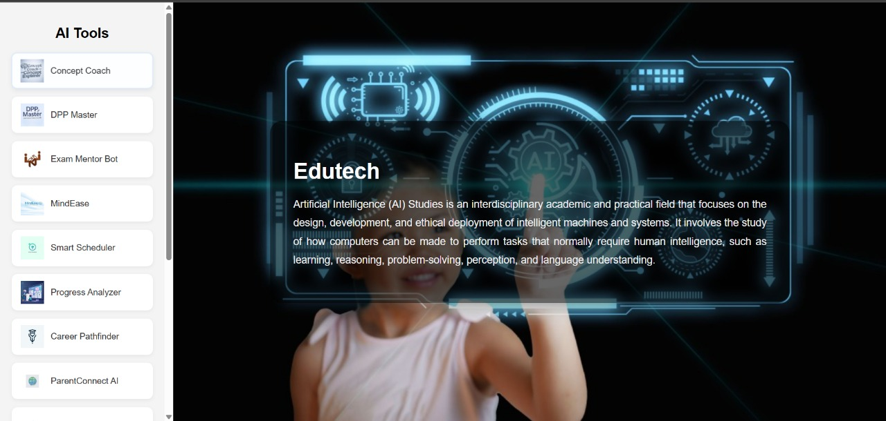

# 🎓 Edutech AI Widgets

**Edutech AI Widgets** is a voice-first interactive dashboard that brings together 15+ AI tools using [Omnidimension](https://omnidimension.ai). Designed for students, it helps with exam preparation, smart planning, mental wellness, multilingual concept explanation, performance tracking, and more — all within a single unified interface.



---

## 🚨 Problem Statement

Students preparing for competitive exams face multiple challenges:
- Vast and scattered syllabus
- Inconsistent study schedules
- No personalized practice sessions
- Limited access to mentors
- Mental health and stress issues
- Lack of gamified and interactive learning tools

---

## ✅ Solution Overview

**Edutech AI Widgets** solves these problems with:
- A centralized AI dashboard
- Voice-first intelligent agents for different purposes
- Daily practice generators, mental wellness bots, syllabus planners
- AI-powered insights on student performance
- Parent integration via voice reports
- Clean UI with non-overlapping widgets and smooth interactions

---

## 🛠 Tech Stack

| Layer         | Technologies / Tools                         |
|---------------|----------------------------------------------|
| Frontend      | HTML, CSS, JavaScript                        |
| Widgets       | Omnidimension AI Widgets (script embeds)     |
| Backend (AI)  | OpenAI models (via Omnidimension platform)   |
| Deployment    | GitHub Pages / Vercel / Netlify              |

---

## 🌟 Features

- 🎙️ **Voice-first AI agents**
- 📘 **Concept explanations (Concept Coach)**
- 📅 **Daily practice generator (DPP Master)**
- 🧘 **Mental health bot (MindEase)**
- 📈 **Progress Analyzer**
- 👨‍👩‍👧 **ParentConnect AI**
- 🌐 **LangSwitch for multilingual support**
- 🎮 **QuizMaster for gamified learning**
- 🔁 **Non-overlapping dynamic widgets**

---

## 📂 Project Structure

.
├── index.html # Main HTML file
├── style.css # Styles and animations
├── img/ # Agent icons and background image
├── README.md # Documentation
├── requirements.txt # Runtime dependencies (if any)

yaml
Copy
Edit

---

## 🧑‍💻 Contributors

| Name                     | Role                            |
|--------------------------|----------------------------------|
| **Soumyadeep Sarkar**    | Developer / UI Engineer         |
| **Chinmayi Kallurmath**  | AI Flow Designer / UX Lead      |
| **Rishabh Roy**          | Research & Integration          |
| **Sindhuja**             | Frontend Enhancer / QA          |
| **OpenAI / Omnidimension** | AI Widget Backend Support     |

---

## 🚀 Setup Instructions

1. **Clone the Repository**
   ```bash
   git clone https://github.com/your-username/edutech-ai-widgets.git
   cd edutech-ai-widgets
Run Locally
Just open index.html in your browser — no server required.

Or Run with Python (Optional)

bash
Copy
Edit
python -m http.server
Deploy on GitHub Pages or Vercel
Upload your project and go live in minutes!

📘 Usage Guide
Click on any agent in the sidebar to load its AI widget.

Only one widget is shown at a time — others automatically close.

Interact with the bot using voice or text input.

To reset, refresh the page or select a different bot.

📦 requirements.txt
txt
Copy
Edit
# Only needed if serving locally using Python
python>=3.6
No third-party libraries needed.

🌐 Demo (optional)

https://hackhunters2025.github.io/MS_HYD/